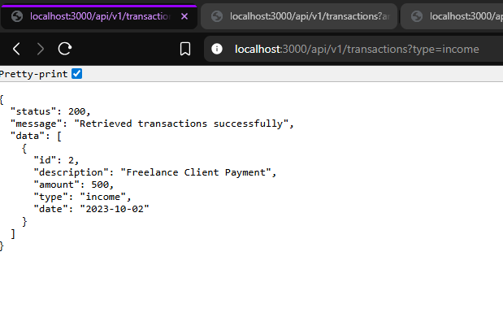
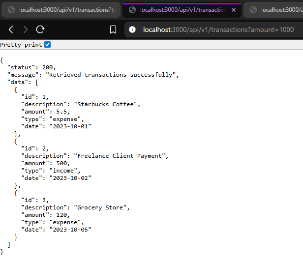
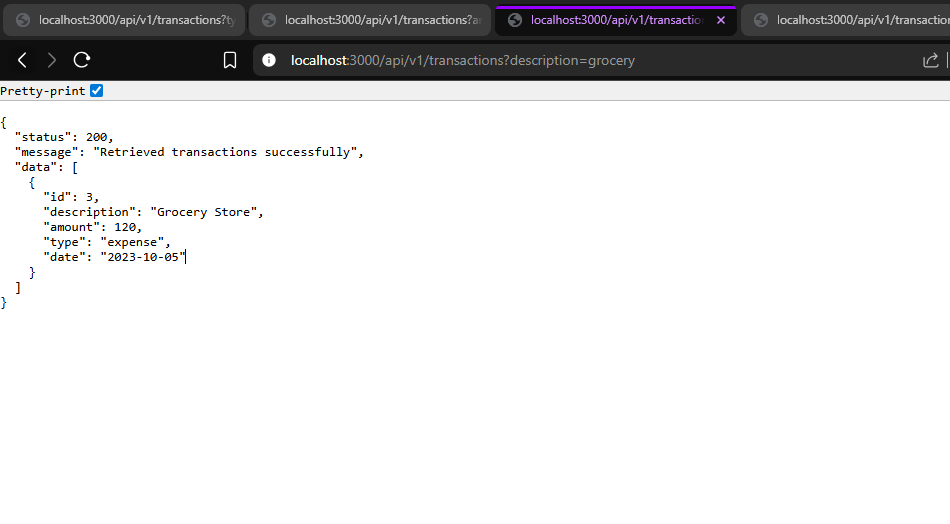
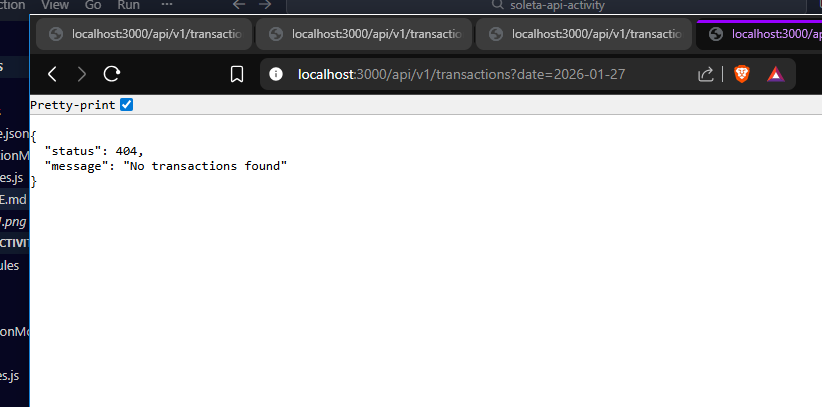
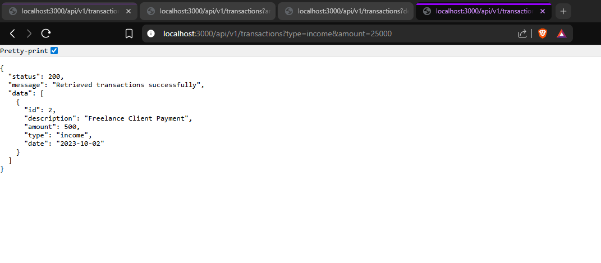
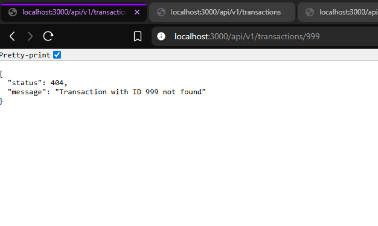
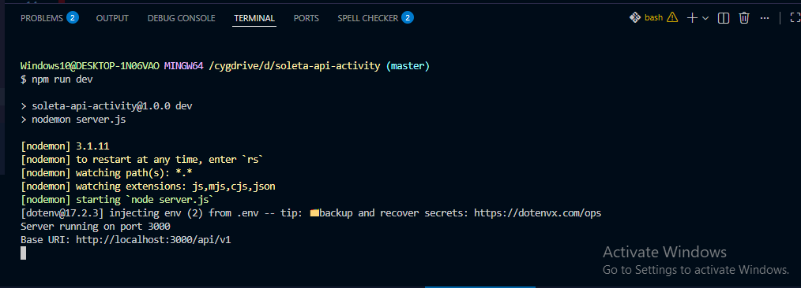

Markdown
# RESTful API Activity - Bea D. Soleta
## Best Practices Implementation

**1. Environment Variables:**
- Why did we put `BASE_URI` in `.env` instead of hardcoding it?
Answer: I put the BASE_URI in .env to easily switch between development and production environments without modifying the code. This is more flexible and safe compared to hardcoding.

**2. Resource Modeling:**
- Why did we use plural nouns (e.g., `/dishes`) for our routes?
Answer: I used plural nouns like /transactions to clearly show that the route handles multiple resources. This also follows standard REST API conventions for consistency.

**3. Status Codes:**
- When do we use `201 Created` vs `200 OK`?
We use 201 Created when a request successfully creates a new resource on the server, such as adding a new records. We use 200 OK when the request is successful but does not create a new resource, like fetching or updating existing data. Using the correct status code helps clearly communicate the result of the requests to the client.
- Why is it important to return `404` instead of just an empty array or a generic error?
Answer: I return 201 Created for adding a new resource and 200 OK for a successful request. It is important to return 404 to indicate that the resource is not found and not just a empty response. This will help the client to understand it better.

**4. Testing:**
- (Paste a screenshot of a successful GET request here)
Here are some screenshot that I run my codes. I test some possible GET paths that can will work successfully with my /transactions CRUD API using query parameters. Here’s a clear list of working examples:

Submission Checklist
1. [✓] Code runs via npm run dev with no errors.

2. [✓] All routes (/api/v1/resource) work correctly.
3. [✓] Error handling (400/404) is implemented.
4. [✓] GitHub Repo link submitted.
5. [✓] README.md explains the "Why" behind the code.

Hands On Activity 2
UPDATE Github

Deliverable
Update your GitHub Repository.
1. Create the New Model file (Chef, User, or Guest).✓
2. Update your Main Model with Validations (min, max) and Relationships (ref, 
embedded).✓
3. In your README.md, answer:
o "Why did I choose to Embed the [Review/Tag/Log]?"
I chose to embed the tag to keep the context directly within the record. Embedding ensures clarity, traceability, and makes the information self-contained.  
o "Why did I choose to Reference the [Chef/User/Guest]?"
I referenced the User to highlight their role and add credibility. This connection makes the record more meaningful and tied to real contributors.  
