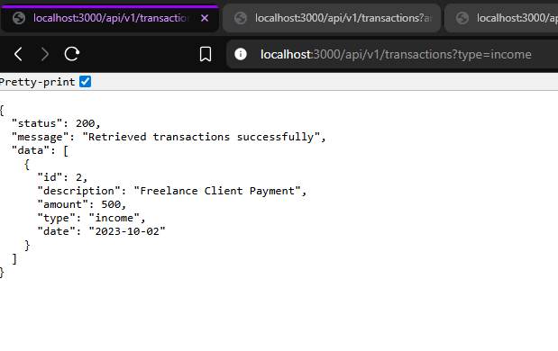
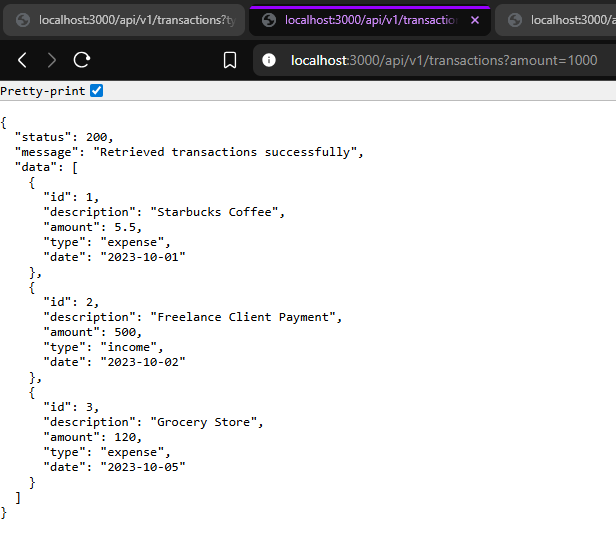
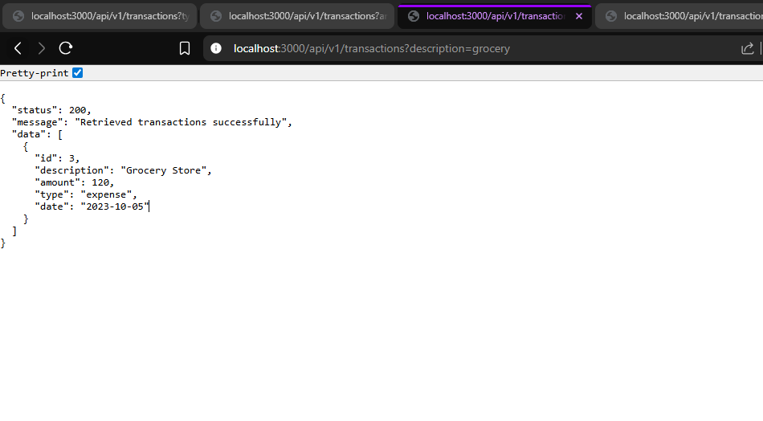
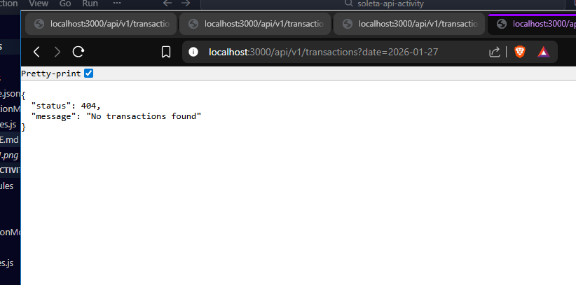
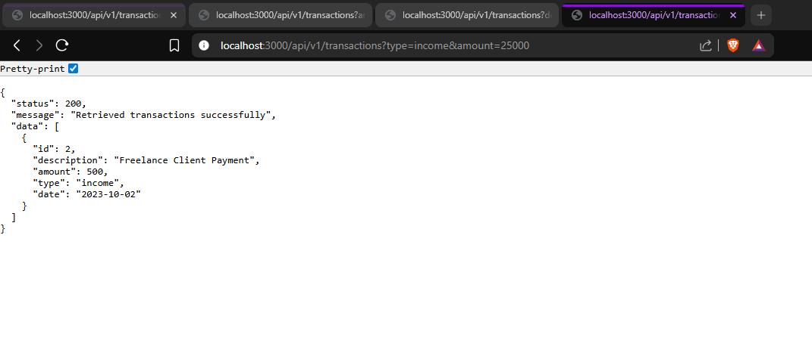
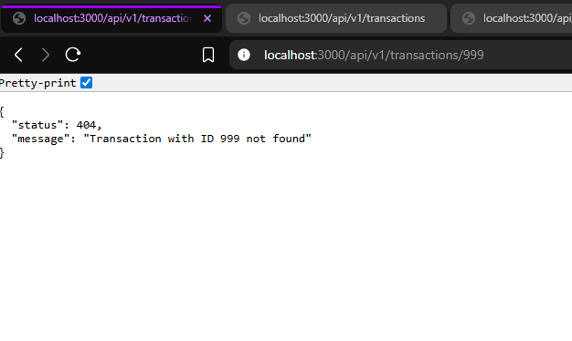
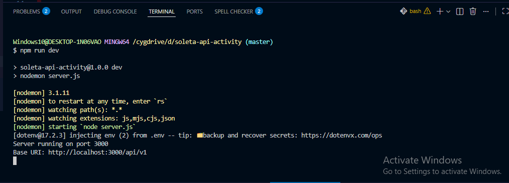
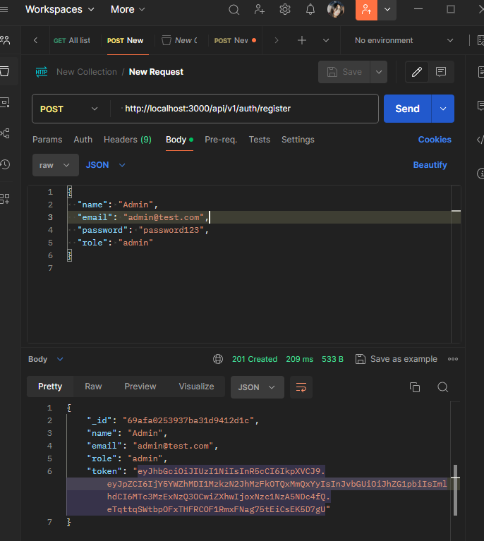

Markdown
# RESTful API Activity - Bea D. Soleta
## Best Practices Implementation

**1. Environment Variables:**
- Why did we put `BASE_URI` in `.env` instead of hardcoding it?
Answer: I put the BASE_URI in .env to easily switch between development and production environments without modifying the code. This is more flexible and safe compared to hardcoding.

**2. Resource Modeling:**
- Why did we use plural nouns (e.g., `/dishes`) for our routes?
Answer: I used plural nouns like /transactions to clearly show that the route handles multiple resources. This also follows standard REST API conventions for consistency.

**3. Status Codes:**
- When do we use `201 Created` vs `200 OK`?
We use 201 Created when a request successfully creates a new resource on the server, such as adding a new records. We use 200 OK when the request is successful but does not create a new resource, like fetching or updating existing data. Using the correct status code helps clearly communicate the result of the requests to the client.
- Why is it important to return `404` instead of just an empty array or a generic error?
Answer: I return 201 Created for adding a new resource and 200 OK for a successful request. It is important to return 404 to indicate that the resource is not found and not just a empty response. This will help the client to understand it better.

**4. Testing:**
- (Paste a screenshot of a successful GET request here)
Here are some screenshot that I run my codes. I test some possible GET paths that can will work successfully with my /transactions CRUD API using query parameters. Here’s a clear list of working examples:

Submission Checklist
1. [✓] Code runs via npm run dev with no errors.

2. [✓] All routes (/api/v1/resource) work correctly.
3. [✓] Error handling (400/404) is implemented.
4. [✓] GitHub Repo link submitted.
5. [✓] README.md explains the "Why" behind the code.

Hands On Activity 2
UPDATE Github

HANDS ON ACTIVITY 3
Update your GitHub Repository.
1. Create the New Model file (Chef, User, or Guest).
2. Update your Main Model with Validations (min, max) and Relationships (ref,
embedded).
3. In your README.md, answer:
o "Why did I choose to Embed the [Review/Tag/Log]?"
I choose to Embed the 
o "Why did I choose to Reference the [Chef/User/Guest]?"

Submission Checklist & README.md
Update your README.md with the following questions to prove your
understanding:
1. [ ] Code runs via npm run dev with no errors.
2. [ ] Registration and Login endpoints are functional.

3. [ ] Middleware correctly blocks unauthorized users.
4. [ ] GitHub Repo link submitted.
5. [ ] README.md updated with the following answers:
README.md Questions:
1. Authentication vs Authorization:
o What is the difference between Authentication and Authorization in our
code?
o Answer:
2. Security (bcrypt):
o Why did we use bcryptjs instead of saving passwords as plain text in
MongoDB?
o Answer:
3. JWT Structure:
o What does the protect middleware do when it receives a JWT from the
client?
o Answer: